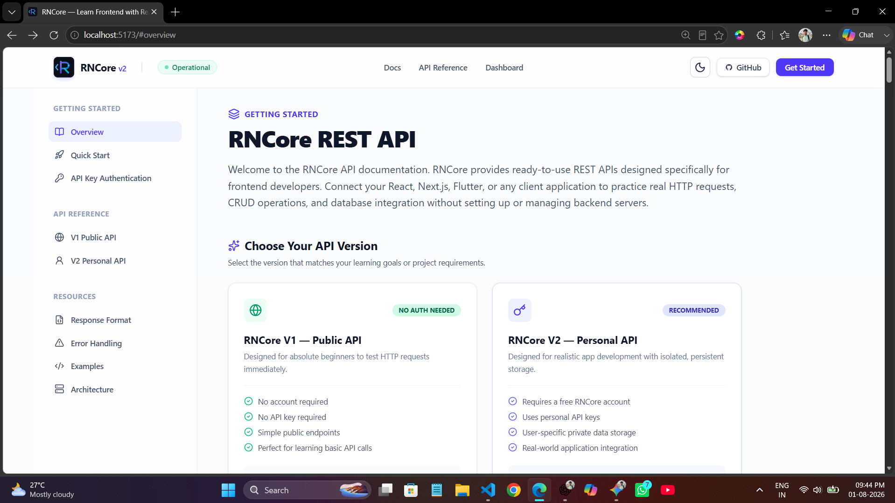
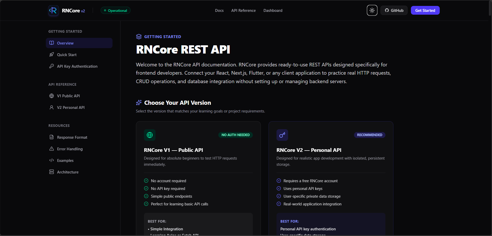
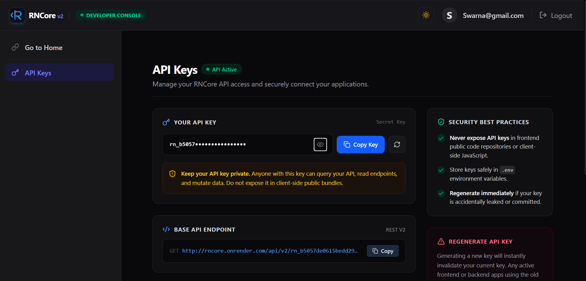

# RNCore

**RNCore** is a beginner-friendly REST API built for learning frontend and backend integration.

Instead of working with fake JSON data, you can use RNCore to build real applications that perform actual CRUD (Create, Read, Update, Delete) operations using a database.

This project is designed for students and beginner developers who want to understand how frontend applications communicate with a backend API.

---

## 📸 App Preview

<p align="center">
  
  
</p>
<p align="center">
  <sub><b>Home Dashboard</b> (Light & Dark Mode)</sub>
</p>

<br/>

<p align="center">
  
</p>
<p align="center">
  <sub><b>API Documentation & Endpoint Explorer</b></sub>
</p>

---

# ✨ Features

- Beginner-friendly REST API
- Real database storage using MongoDB
- Create todos
- Fetch todos
- Update todos
- Delete todos
- Clean and consistent JSON responses
- Proper HTTP status codes
- Input validation
- Perfect for learning API integration

---

# 🎯 Who is this for?

RNCore is made for developers who are learning:

- React
- JavaScript
- API Integration
- CRUD Operations
- REST APIs
- Backend Communication

No backend knowledge is required.

---

# 📚 What You'll Learn

By using RNCore, you will learn how to:

- Send GET requests
- Send POST requests
- Send PATCH requests
- Send DELETE requests
- Send JSON data
- Receive JSON responses
- Handle loading states
- Handle API errors
- Connect frontend applications with a real backend

---

# 🔄 How API Works

A simple overview:

```
Frontend Application
        |
        | HTTP Request
        ↓
      RNCore API
        |
        | Database Operation
        ↓
      MongoDB Database
        |
        | JSON Response
        ↓
Frontend Application
```

Example:

```
React App
   |
POST /todos
   |
RNCore API
   |
Save todo in Database
   |
Return created todo
```

---

# 📚 API Versions

RNCore provides two API versions for different learning levels.

## V1 - Public API

V1 is designed for beginners who are learning API integration.

Features:

- No account required
- Public todo data
- Simple CRUD operations
- Easy frontend integration


---

# Base URL

```
https://rncore.onrender.com/api/v1
```

Example API URL:

```
https://rncore.onrender.com/api/v1/todos
```

Understanding:

```
https://rncore.onrender.com → Backend server

/api/v1 → API version

/todos → Todo resource
```

---

## V2 - Private API

V2 provides a more realistic backend experience.

Features:

- User accounts
- Personal API URL
- Private user data
- Real database storage
- Secure API access

To use V2, users need to create an account through the RNCore platform.


---

# API Documentation

# Todo Resource

A Todo represents a single task.

---

## Todo Fields

| Field | Type | Required | Description |
|---|---|---|---|
| `_id` | String | Auto | Unique identifier generated by MongoDB |
| `title` | String | Yes | Name of the todo |
| `isCompleted` | Boolean | No | Shows whether the task is completed |
| `createdAt` | Date | Auto | Todo creation time |
| `updatedAt` | Date | Auto | Last update time |

---

## Example Todo

```json
{
  "_id": "6890abcd1234567890ef1234",
  "title": "Learn React API Integration",
  "isCompleted": false,
  "createdAt": "2026-07-30T08:15:42.123Z",
  "updatedAt": "2026-07-30T08:15:42.123Z"
}
```

---

# Validation Rules

## title

- Required
- Must be a string
- Empty values are not allowed
- Leading and trailing spaces are removed automatically

---

## isCompleted

- Optional
- Must be a boolean
- Default value is `false`

Example:

```json
{
  "isCompleted": true
}
```

---

# 1. Create Todo

Creates a new todo.

## Endpoint

```http
POST /todos
```

---

## Request Body

```json
{
  "title": "Learn React API Integration"
}
```

---

## Success Response

Status:

```
201 Created
```

Response:

```json
{
  "success": true,
  "message": "Todo created successfully",
  "data": {
    "_id": "6890xxxx",
    "title": "Learn React API Integration",
    "isCompleted": false,
    "createdAt": "2026-07-30T08:15:42.123Z",
    "updatedAt": "2026-07-30T08:15:42.123Z"
  }
}
```

---

## Error Response

If title is missing:

Request:

```json
{
  "title": ""
}
```

Response:

```json
{
  "success": false,
  "message": "Title is required"
}
```

---

# 2. Get All Todos

Returns all available todos.

## Endpoint

```http
GET /todos
```

---

## Success Response

Status:

```
200 OK
```

Response:

```json
{
  "success": true,
  "message": "Todos fetched successfully",
  "data": [
    {
      "_id": "6890xxxx",
      "title": "Learn React",
      "isCompleted": false,
      "createdAt": "2026-07-30T08:15:42.123Z",
      "updatedAt": "2026-07-30T08:15:42.123Z"
    },
    {
      "_id": "6890yyyy",
      "title": "Build Todo App",
      "isCompleted": true,
      "createdAt": "2026-07-30T09:20:10.456Z",
      "updatedAt": "2026-07-30T10:05:30.789Z"
    }
  ]
}
```

---

# 3. Update Todo

Updates an existing todo.

## Endpoint

```http
PATCH /todos/:id
```

Example:

```http
PATCH /todos/6890xxxx
```

---

## Request Body

You can update one field or multiple fields.

Example:

```json
{
  "title": "Learn Express",
  "isCompleted": true
}
```

Only update status:

```json
{
  "isCompleted": true
}
```

---

## Success Response

```json
{
  "success": true,
  "message": "Todo updated successfully",
  "data": {
    "_id": "6890xxxx",
    "title": "Learn Express",
    "isCompleted": true,
    "createdAt": "2026-07-30T08:15:42.123Z",
    "updatedAt": "2026-07-30T10:25:30.456Z"
  }
}
```

---

# 4. Delete Todo

Deletes a todo permanently.

## Endpoint

```http
DELETE /todos/:id
```

Example:

```http
DELETE /todos/6890xxxx
```

---

## Success Response

```json
{
  "success": true,
  "message": "Todo deleted successfully"
}
```

---

# Common HTTP Status Codes

| Code | Meaning |
|---|---|
| 200 | Request successful |
| 201 | Resource created |
| 400 | Bad request |
| 404 | Resource not found |
| 500 | Internal server error |

---

# Example React Integration

```javascript
const response = await fetch(
  "https://rncore.onrender.com/api/v1/todos"
);

const result = await response.json();

console.log(result.data);
```

---

# Testing API

You can test RNCore using:

- Postman
- Thunder Client (VS Code Extension)

Steps:

1. Choose an API client (Postman / Thunder Client)
2. Send requests using the RNCore API URL
3. Check JSON responses
4. Connect your frontend application

---

# Folder Structure

```
RNCore
│
├── src
│   │
│   ├── controllers
│   ├── models
│   ├── routes
│   ├── config
│   └── server.js
│
├── .env
├── package.json
└── README.md
```

---

# Projects You Can Build

Using RNCore, you can create:

- Todo Application
- Simple Task Manager
- Checklist Application
- Daily Task Tracker
- Learning Progress Tracker

---

# Why RNCore?

Most tutorials use fake JSON data.

RNCore allows you to work with a real backend API and database.

You can build a complete frontend application, connect it with RNCore, and understand how real-world applications communicate with servers.

---

# Future Improvements

Possible future features:

- User authentication
- Multiple users
- User-specific todos
- Search and filtering
- Pagination

---

# Happy Coding! 🚀

© 2026 RNCore. Built by **Kryon Labs**.